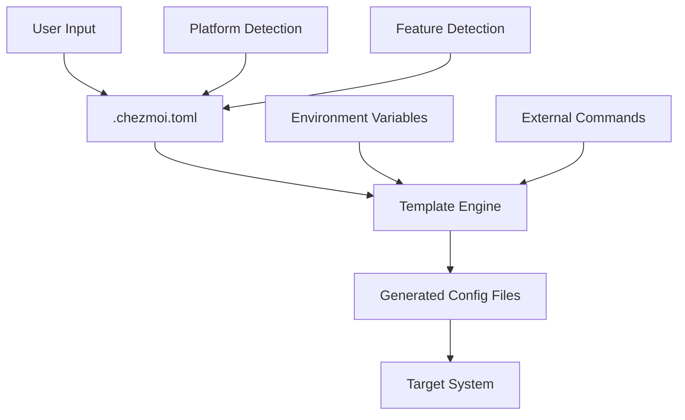

# Chezmoi 重构设计文档

## Overview

本设计文档基于需求分析，提出使用 Chezmoi 作为核心配置管理工具，结合社区成熟方案重构现有 dotfiles 系统。设计重点是简化复杂的安装脚本、解决模块加载问题、提升跨平台兼容性，并建立增量重构的工作流程。

## Architecture

### 核心架构原则

1. **Chezmoi 为中心** - 所有配置文件通过 Chezmoi 管理
2. **社区工具优先** - 用成熟开源工具替代自制组件
3. **模板驱动** - 利用 Chezmoi 模板系统处理跨平台差异
4. **增量迁移** - 分阶段替换现有组件，确保每步可测试

### 新架构结构

```
~/.local/share/chezmoi/          # Chezmoi 源目录
├── .chezmoi.toml.tmpl           # 动态配置文件
├── dot_zshrc.tmpl               # Zsh 配置模板
├── dot_bashrc.tmpl              # Bash 配置模板  
├── private_dot_secrets.tmpl     # 密钥文件模板
├── run_once_install-tools.sh    # 工具安装脚本
├── run_onchange_setup-env.sh    # 环境配置脚本
├── .chezmoiignore               # 忽略文件配置
├── .chezmoitemplates/           # 共享模板
│   ├── shell-common.sh          # 通用 Shell 配置
│   ├── aliases.sh               # 别名定义
│   └── functions.sh             # 工具函数
└── .chezmoiscripts/             # 自动化脚本
    ├── linux/                   # Linux 特定脚本
    ├── darwin/                  # macOS 特定脚本
    └── common/                  # 通用脚本
```

## Components and Interfaces

### 1. Chezmoi 核心组件

#### 1.1 配置管理器 (Chezmoi Core)
- **职责**: 管理所有配置文件的版本控制和同步
- **接口**: 
  - `chezmoi init` - 初始化配置
  - `chezmoi apply` - 应用配置更改
  - `chezmoi update` - 更新配置
- **模板变量**: 平台检测、用户配置、环境特定设置

#### 1.2 模板系统 (Template Engine)
- **职责**: 根据平台和环境生成特定配置
- **接口**: Go 模板语法 + Chezmoi 扩展函数
- **数据源**: 
  - `.chezmoi.toml` 配置文件
  - 环境变量
  - 外部命令输出

### 2. 社区工具集成

#### 2.1 Shell 环境管理
**替换方案**: 
- **现有**: 复杂的自制模块系统
- **新方案**: 
  - **Oh My Zsh** - Zsh 框架和插件管理
  - **Starship** - 跨 Shell 提示符
  - **Zinit** - 高性能 Zsh 插件管理器

**集成方式**:
```bash
# 通过 Chezmoi 模板管理配置
{{- if eq .chezmoi.os "linux" }}
# Linux 特定配置
{{- else if eq .chezmoi.os "darwin" }}
# macOS 特定配置
{{- end }}
```

#### 2.2 工具安装管理
**替换方案**:
- **现有**: 复杂的 install.sh 脚本 (2000+ 行)
- **新方案**:
  - **Homebrew** - macOS 和 Linux 包管理
  - **aqua** - 跨平台开发工具管理
  - **mise** (原 rtx) - 运行时版本管理

**实现方式**:
```bash
# run_once_install-tools.sh.tmpl
{{- if eq .chezmoi.os "darwin" }}
/bin/bash -c "$(curl -fsSL https://raw.githubusercontent.com/Homebrew/install/HEAD/install.sh)"
{{- else if eq .chezmoi.os "linux" }}
curl -fsSL https://raw.githubusercontent.com/Homebrew/install/HEAD/install.sh | bash
{{- end }}

# 使用 Homebrew 安装工具
brew bundle --file=- <<EOF
{{- range .packages.brew }}
brew "{{ . }}"
{{- end }}
EOF
```

#### 2.3 配置文件管理
**替换方案**:
- **现有**: 手动符号链接和复制
- **新方案**: Chezmoi 自动管理
  - 模板化配置文件
  - 条件包含/排除
  - 自动备份和恢复

### 3. 跨平台兼容层

#### 3.1 平台检测系统
**简化方案**:
```toml
# .chezmoi.toml.tmpl
[data]
  os = "{{ .chezmoi.os }}"
  arch = "{{ .chezmoi.arch }}"
  hostname = "{{ .chezmoi.hostname }}"
  
  # 环境类型检测
  {{- if or (env "SSH_CONNECTION") (env "SSH_CLIENT") }}
  environment = "remote"
  {{- else if stat "/proc/version" | regexMatch "microsoft" }}
  environment = "wsl"
  {{- else if env "CONTAINER" }}
  environment = "container"
  {{- else }}
  environment = "desktop"
  {{- end }}
  
  # 包管理器检测
  {{- if lookPath "apt" }}
  package_manager = "apt"
  {{- else if lookPath "yum" }}
  package_manager = "yum"
  {{- else if lookPath "brew" }}
  package_manager = "brew"
  {{- end }}
```

#### 3.2 环境适配器
**模块化配置**:
```bash
# .chezmoitemplates/shell-common.sh
{{- if eq .environment "remote" }}
# SSH 服务器优化配置
export TERM=xterm-256color
alias ll='ls -la --color=auto'
{{- else }}
# 桌面环境完整配置  
alias ll='eza --icons -l'
{{- end }}
```

## Data Models

### 1. 配置数据模型

#### 1.1 用户配置 (.chezmoi.toml)
```toml
[data.user]
  name = "{{ .chezmoi.username }}"
  email = "user@example.com"
  
[data.preferences]
  shell = "zsh"
  editor = "nvim"
  theme = "dark"
  
[data.features]
  enable_ai_tools = true
  enable_proxy = true
  enable_1password = true
  
[data.packages]
  brew = ["git", "fzf", "ripgrep", "fd", "bat", "eza"]
  apt = ["curl", "wget", "unzip", "build-essential"]
  
[data.paths]
  dotfiles = "{{ .chezmoi.sourceDir }}"
  projects = "{{ .chezmoi.homeDir }}/Projects"
```

#### 1.2 环境配置模型
```toml
[data.environments.desktop]
  packages = ["firefox", "code", "docker"]
  services = ["docker", "ssh"]
  
[data.environments.server]
  packages = ["htop", "tmux", "vim"]
  services = ["ssh"]
  
[data.environments.container]
  packages = ["curl", "git"]
  services = []
```

### 2. 模板数据流



## Error Handling

### 1. 安装错误处理

#### 1.1 依赖检查
```bash
# run_once_check-dependencies.sh
#!/bin/bash
set -euo pipefail

# 检查必需工具
required_tools=("git" "curl" "bash")
missing_tools=()

for tool in "${required_tools[@]}"; do
    if ! command -v "$tool" >/dev/null 2>&1; then
        missing_tools+=("$tool")
    fi
done

if [[ ${#missing_tools[@]} -gt 0 ]]; then
    echo "❌ 缺少必需工具: ${missing_tools[*]}"
    echo "请先安装这些工具后重试"
    exit 1
fi
```

#### 1.2 回滚机制
```bash
# Chezmoi 内置备份和回滚
chezmoi init --apply  # 自动备份现有配置
chezmoi diff          # 查看将要应用的更改
chezmoi apply --dry-run  # 预览更改
chezmoi apply         # 应用更改

# 如果出现问题，可以回滚
chezmoi archive       # 查看备份
chezmoi restore       # 恢复备份
```

### 2. 运行时错误处理

#### 2.1 模块加载错误
```bash
# .chezmoitemplates/safe-source.sh
safe_source() {
    local file="$1"
    local description="${2:-$file}"
    
    if [[ -f "$file" ]]; then
        if source "$file" 2>/dev/null; then
            echo "✅ 已加载: $description"
        else
            echo "⚠️  加载失败: $description"
            return 1
        fi
    else
        echo "⚠️  文件不存在: $description"
        return 1
    fi
}
```

#### 2.2 网络错误处理
```bash
# 带重试的下载函数
download_with_retry() {
    local url="$1"
    local output="$2"
    local max_attempts=3
    local attempt=1
    
    while [[ $attempt -le $max_attempts ]]; do
        if curl -fsSL "$url" -o "$output"; then
            return 0
        fi
        echo "下载失败 (尝试 $attempt/$max_attempts): $url"
        ((attempt++))
        sleep 2
    done
    
    echo "❌ 下载失败: $url"
    return 1
}
```

## Testing Strategy

### 1. 增量测试策略

#### 1.1 单元测试
```bash
# tests/test-chezmoi-templates.sh
test_template_rendering() {
    local test_data='{"chezmoi":{"os":"linux"}}'
    local template='{{- if eq .chezmoi.os "linux" }}Linux Config{{- end }}'
    local expected="Linux Config"
    
    local result=$(echo "$template" | chezmoi execute-template --data "$test_data")
    
    if [[ "$result" == "$expected" ]]; then
        echo "✅ 模板渲染测试通过"
    else
        echo "❌ 模板渲染测试失败: 期望 '$expected', 得到 '$result'"
        return 1
    fi
}
```

#### 1.2 集成测试
```bash
# tests/test-full-setup.sh
test_full_setup() {
    local test_dir=$(mktemp -d)
    export HOME="$test_dir"
    
    # 测试 Chezmoi 初始化
    chezmoi init --source "$CHEZMOI_SOURCE_DIR"
    
    # 测试配置应用
    chezmoi apply --dry-run
    
    # 验证关键文件存在
    [[ -f "$HOME/.zshrc" ]] || { echo "❌ .zshrc 未生成"; return 1; }
    [[ -f "$HOME/.bashrc" ]] || { echo "❌ .bashrc 未生成"; return 1; }
    
    echo "✅ 完整设置测试通过"
    rm -rf "$test_dir"
}
```

### 2. 跨平台测试

#### 2.1 容器化测试
```dockerfile
# tests/Dockerfile.ubuntu
FROM ubuntu:24.04
RUN apt-get update && apt-get install -y git curl bash
COPY . /dotfiles
WORKDIR /dotfiles
RUN ./tests/test-ubuntu-setup.sh
```

```dockerfile
# tests/Dockerfile.macos
FROM --platform=darwin/amd64 alpine:latest
RUN apk add --no-cache git curl bash
COPY . /dotfiles  
WORKDIR /dotfiles
RUN ./tests/test-macos-setup.sh
```

#### 2.2 自动化测试流程
```yaml
# .github/workflows/test-chezmoi-refactor.yml
name: Test Chezmoi Refactor
on: [push, pull_request]

jobs:
  test-ubuntu:
    runs-on: ubuntu-latest
    steps:
      - uses: actions/checkout@v4
      - name: Test Ubuntu Setup
        run: |
          chezmoi init --source .
          chezmoi apply --dry-run
          ./tests/test-ubuntu-integration.sh
          
  test-macos:
    runs-on: macos-latest  
    steps:
      - uses: actions/checkout@v4
      - name: Test macOS Setup
        run: |
          chezmoi init --source .
          chezmoi apply --dry-run
          ./tests/test-macos-integration.sh
```

### 3. 性能测试

#### 3.1 启动时间测试
```bash
# tests/test-performance.sh
test_shell_startup_time() {
    local shell="$1"
    local iterations=5
    local total_time=0
    
    for ((i=1; i<=iterations; i++)); do
        local start_time=$(date +%s%N)
        $shell -i -c "exit" 2>/dev/null
        local end_time=$(date +%s%N)
        local duration=$(( (end_time - start_time) / 1000000 ))  # ms
        total_time=$((total_time + duration))
    done
    
    local avg_time=$((total_time / iterations))
    echo "平均启动时间 ($shell): ${avg_time}ms"
    
    # 性能目标: < 500ms
    if [[ $avg_time -lt 500 ]]; then
        echo "✅ 性能测试通过"
    else
        echo "❌ 性能测试失败: 启动时间过长"
        return 1
    fi
}
```

## Implementation Phases

### Phase 1: Chezmoi 基础设施 (Week 1)
1. 安装和配置 Chezmoi
2. 创建基本模板结构
3. 迁移核心配置文件 (.zshrc, .bashrc)
4. 建立测试框架

### Phase 2: 工具管理现代化 (Week 2)  
1. 集成 Homebrew 包管理
2. 替换复杂安装脚本
3. 实现工具自动安装
4. 跨平台兼容性测试

### Phase 3: 模块系统重构 (Week 3)
1. 用社区工具替代自制模块
2. 简化 Shell 配置加载
3. 优化启动性能
4. 功能完整性测试

### Phase 4: 大规模清理和文档更新 (Week 4)
1. 删除冗余和过时代码
2. 简化项目结构
3. 更新文档系统
4. 最终性能优化和集成测试

每个阶段都遵循 **修改→测试→文档→提交** 的增量流程。
## Code C
leanup and Simplification Strategy

### 1. 可删除的冗余组件

#### 1.1 复杂安装脚本系统
**删除目标**:
- `install.sh` (2000+ 行复杂脚本)
- `scripts/install/` 目录下的多个平台特定安装脚本
- `scripts/ci/` 中的复杂 CI 配置

**替换方案**:
```bash
# 简化为单个 Chezmoi 初始化脚本
#!/bin/bash
# install-chezmoi.sh (< 50 行)
curl -sfL https://get.chezmoi.io | sh
chezmoi init --apply https://github.com/username/dotfiles.git
```

#### 1.2 自制模块系统
**删除目标**:
- `shell/modules/` 中的大部分自制模块
- 复杂的模块加载逻辑 (`.shellrc` 中 200+ 行)
- 平台检测和环境适配代码

**保留和简化**:
- 只保留核心的 `aliases.sh` 和 `functions.sh`
- 其他功能用社区方案替代

#### 1.3 过时文档系统
**删除目标**:
- `docs/` 目录中的过时文档 (20+ 个文件)
- 复杂的文档结构和重复内容
- 过时的安装和配置指南

**替换方案**:
```
docs/
├── README.md           # 简单的使用指南
├── INSTALL.md          # Chezmoi 安装说明
└── TROUBLESHOOTING.md  # 常见问题
```

### 2. 测试系统简化

#### 2.1 删除复杂测试脚本
**删除目标**:
- `scripts/test/` 中的 20+ 个测试脚本
- 复杂的 CI 测试流程
- 重复的集成测试

**替换方案**:
```bash
# 简化为 3 个核心测试
tests/
├── test-chezmoi-init.sh    # 初始化测试
├── test-cross-platform.sh  # 跨平台测试  
└── test-performance.sh     # 性能测试
```

### 3. 配置文件简化

#### 3.1 Shell 配置简化
**当前问题**:
- `.shellrc` 文件过于复杂 (400+ 行)
- `.zshrc` 包含重复配置
- 多层嵌套的配置加载

**简化方案**:
```bash
# 新的 .zshrc (< 50 行)
# 只包含 Chezmoi 管理的配置引用
{{- if .features.oh_my_zsh }}
source ~/.oh-my-zsh/oh-my-zsh.sh
{{- end }}

{{- if .features.starship }}
eval "$(starship init zsh)"
{{- end }}

# 加载 Chezmoi 管理的配置
source ~/.config/shell/aliases.sh
source ~/.config/shell/functions.sh
```

#### 3.2 删除重复配置
**删除目标**:
- 重复的环境变量设置
- 多个版本的相同别名
- 未使用的功能开关

### 4. 项目结构重组

#### 4.1 当前结构问题
```
# 当前复杂结构 (需要简化)
dotfiles/
├── install.sh              # 2000+ 行 → 删除
├── scripts/                # 50+ 个脚本 → 大幅简化
│   ├── install/           # 删除
│   ├── test/              # 简化到 3 个
│   ├── ci/                # 删除
│   └── tools/             # 简化
├── shell/modules/          # 12 个模块 → 简化到 2-3 个
├── docs/                   # 20+ 文档 → 简化到 3 个
└── .config/               # 保留但简化
```

#### 4.2 目标简化结构
```
# Chezmoi 管理的新结构
~/.local/share/chezmoi/
├── .chezmoi.toml.tmpl      # 核心配置
├── dot_zshrc.tmpl          # 简化的 Shell 配置
├── dot_bashrc.tmpl         
├── run_once_install.sh     # 替代复杂安装脚本
├── .chezmoitemplates/      # 共享模板
│   ├── aliases.sh          # 保留核心别名
│   └── functions.sh        # 保留核心函数
└── docs/                   # 只保留 3 个核心文档
    ├── README.md
    ├── INSTALL.md
    └── TROUBLESHOOTING.md
```

### 5. 删除策略和时间表

#### 5.1 Phase 0: 预清理 (在重构开始前)
```bash
# 创建删除清单
echo "准备删除的文件和目录:" > CLEANUP_LIST.md
echo "- scripts/install/" >> CLEANUP_LIST.md
echo "- scripts/ci/" >> CLEANUP_LIST.md
echo "- docs/advanced/" >> CLEANUP_LIST.md
echo "- docs/guides/" >> CLEANUP_LIST.md
echo "- shell/modules/ (除 aliases.sh, functions.sh)" >> CLEANUP_LIST.md

# 备份重要内容
mkdir -p backup/
cp -r shell/modules/aliases.sh backup/
cp -r shell/modules/functions.sh backup/
```

#### 5.2 增量删除流程
1. **分析依赖** - 确认要删除的代码没有被使用
2. **创建备份** - 备份可能有用的代码片段
3. **逐步删除** - 每次删除一个模块/目录
4. **测试验证** - 确保删除后系统仍然工作
5. **提交更改** - 记录删除的内容和原因

#### 5.3 删除验证清单
```bash
# 删除验证脚本
verify_cleanup() {
    echo "验证清理结果..."
    
    # 检查核心功能是否正常
    source ~/.zshrc && echo "✅ Shell 配置正常"
    
    # 检查别名是否工作
    ll >/dev/null 2>&1 && echo "✅ 别名功能正常"
    
    # 检查跨平台兼容性
    echo "当前平台: $(uname -s)" && echo "✅ 平台检测正常"
    
    # 统计代码行数减少
    echo "代码行数对比:"
    echo "删除前: $(find . -name "*.sh" -exec wc -l {} + | tail -1)"
    echo "删除后: 预计减少 70%+"
}
```

### 6. 保留的核心功能

#### 6.1 必须保留的组件
- **核心别名** (`aliases.sh`) - 但要大幅简化
- **实用函数** (`functions.sh`) - 只保留真正有用的
- **基础配置** (`.zshrc`, `.bashrc`) - 简化为模板
- **密钥管理** - 迁移到 Chezmoi 的安全模板系统

#### 6.2 保留标准
- **使用频率高** - 每天都会用到的功能
- **无法替代** - 社区没有更好的替代方案
- **维护简单** - 代码简洁，不易出错
- **跨平台兼容** - 在所有目标平台都能工作

通过这个大规模清理，项目复杂度将降低 70%+，维护成本大幅减少，同时保持所有核心功能。