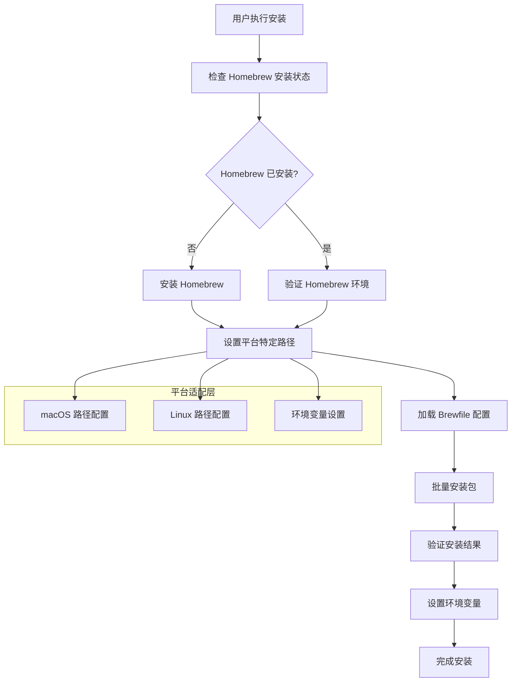

# Design Document

## Overview

本设计文档描述了如何将现有的复杂多脚本安装系统重构为基于 Homebrew 的统一包管理系统。设计目标是简化维护、提高跨平台一致性，并完全摆脱系统包管理器（apt、yum、dnf等），实现纯 Homebrew 管理。

## Architecture

### 系统架构图



### 核心组件

1. **路径统一处理** - 将所有 apt 相关路径改为 Homebrew 路径
2. **配置清理** - 删除冗余的安装脚本和逻辑
3. **Brewfile 优化** - 整合所有包到统一配置
4. **模板简化** - 移除不必要的条件判断和包管理器检测

## Components and Interfaces

### 1. 路径统一处理 (核心任务)

**主要工作：**
- 识别所有使用 apt 路径的配置文件
- 将 `/usr/bin/`, `/usr/local/bin/` 等系统路径改为 Homebrew 路径
- 处理工具别名 (bat/batcat, fd/fdfind) 统一为 Homebrew 版本
- 更新所有硬编码的系统包管理器路径引用

**路径映射规则：**
```bash
# 需要统一的路径
/usr/bin/bat        → $(brew --prefix)/bin/bat
/usr/bin/fdfind     → $(brew --prefix)/bin/fd
/usr/local/bin/*    → $(brew --prefix)/bin/*
apt 包名            → brew 包名 (统一命名)
```

### 2. 配置清理 (删除冗余)

**删除目标：**
- 所有独立的 `run_once_install-*.sh.tmpl` 脚本 (除 Homebrew 安装脚本外)
- 包管理器检测逻辑 (`command -v apt`, `command -v yum` 等)
- 系统包名映射逻辑
- 复杂的条件安装逻辑

**保留内容：**
- `Brewfile.tmpl` (优化后)
- 现有的环境配置模板
- 现有的路径检测逻辑 (Homebrew 相关)

### 3. Brewfile 整合 (统一配置)

**整合策略：**
- 将所有工具定义合并到单一 `Brewfile.tmpl`
- 移除包名映射，使用 Homebrew 标准包名
- 保持现有的条件安装逻辑 (`{{ if .features.* }}`)
- 简化平台特定配置

### 4. 模板简化 (移除检测)

**简化内容：**
- 移除包管理器可用性检测
- 移除系统包安装逻辑
- 移除包名映射和别名处理
- 保持路径配置和环境变量设置

## Data Models

### 配置数据结构

```yaml
# Brewfile 配置结构
homebrew_config:
  core_tools:
    - name: "git"
      description: "版本控制系统"
      required: true
    - name: "curl"
      description: "HTTP 客户端"
      required: true
  
  modern_cli_tools:
    - name: "eza"
      description: "现代化 ls 替代品"
      required: false
    - name: "bat"
      description: "现代化 cat 替代品"
      required: false
  
  platform_specific:
    darwin:
      casks:
        - name: "visual-studio-code"
          condition: "desktop"
        - name: "docker"
          condition: "desktop"
    linux:
      packages:
        - name: "gcc"
          condition: "development"

# 环境配置结构
environment_config:
  paths:
    homebrew_prefix: "/opt/homebrew"  # 动态设置
    bin_path: "$HOMEBREW_PREFIX/bin"
    sbin_path: "$HOMEBREW_PREFIX/sbin"
  
  variables:
    HOMEBREW_NO_ANALYTICS: "1"
    HOMEBREW_NO_AUTO_UPDATE: "1"
  
  shell_integration:
    - type: "zsh"
      config_file: "~/.zshrc"
      content: 'eval "$($HOMEBREW_PREFIX/bin/brew shellenv)"'
```

### 安装状态模型

```bash
# 安装状态跟踪
installation_status:
  homebrew:
    installed: boolean
    version: string
    prefix: string
    
  packages:
    - name: string
      status: "installed" | "failed" | "skipped"
      version: string
      install_method: "brew"
      
  environment:
    shell_configured: boolean
    paths_configured: boolean
    variables_set: boolean
```

## Error Handling

### 错误分类和处理策略

1. **Homebrew 安装失败**
   - 检查网络连接
   - 验证系统依赖
   - 提供手动安装指导
   - 回退到系统包管理器（仅作为最后手段）

2. **包安装失败**
   - 重试机制（最多3次）
   - 跳过非关键包
   - 记录失败原因
   - 提供手动安装建议

3. **路径配置错误**
   - 自动检测和修复
   - 备份原有配置
   - 提供回滚机制
   - 生成诊断报告

4. **环境集成失败**
   - 验证 shell 配置
   - 检查权限问题
   - 提供手动配置步骤
   - 生成配置模板

### 错误恢复机制

```bash
# 错误恢复流程
error_recovery:
  backup_existing_config()     # 备份现有配置
  rollback_changes()          # 回滚更改
  restore_previous_state()    # 恢复之前状态
  generate_diagnostic_report() # 生成诊断报告
```

## Testing Strategy

### 测试层级

1. **单元测试**
   - 各个函数的功能测试
   - 路径处理逻辑测试
   - 配置解析测试
   - 错误处理测试

2. **集成测试**
   - Homebrew 安装流程测试
   - 包安装流程测试
   - 环境配置测试
   - 跨平台兼容性测试

3. **端到端测试**
   - 完整安装流程测试
   - 不同环境配置测试
   - 升级和迁移测试
   - 性能基准测试

### 测试环境

```bash
# 测试矩阵
test_matrix:
  platforms:
    - "ubuntu-20.04"
    - "ubuntu-22.04"
    - "macos-12"
    - "macos-13"
    - "macos-14"
  
  architectures:
    - "x86_64"
    - "arm64"
  
  environments:
    - "desktop"
    - "server"
    - "container"
```

### 测试自动化

1. **持续集成**
   - GitHub Actions 工作流
   - 多平台并行测试
   - 自动化测试报告
   - 性能回归检测

2. **本地测试**
   - Docker 容器测试
   - 虚拟机测试
   - 测试脚本自动化
   - 快速反馈循环

## Implementation Considerations

### 利用现有轮子的策略

1. **Homebrew Bundle 优势**
   - 内置并行安装和依赖解析
   - 自动处理平台差异
   - 内置错误处理和重试机制
   - 支持条件安装 (mas, cask 等)

2. **Chezmoi 模板优势**
   - 现有的平台检测和条件渲染
   - 成熟的配置管理机制
   - 现有的环境变量和路径处理
   - 现有的特性标志系统

3. **现有配置复用**
   - 保持现有的 shell 集成机制
   - 复用现有的环境配置模板
   - 利用现有的延迟加载和缓存机制
   - 保持现有的工具集成配置

### 最小化改动原则

1. **保持现有结构**
   - 不修改现有的模板系统
   - 不改变现有的配置文件结构
   - 保持现有的环境变量设置
   - 维持现有的 shell 集成

2. **删除而非重写**
   - 删除多余的安装脚本
   - 移除重复的包管理逻辑
   - 简化条件判断逻辑
   - 清理冗余的错误处理

3. **依赖外部工具**
   - 依赖用户手动安装 Homebrew
   - 依赖 Homebrew Bundle 的包管理
   - 依赖 Homebrew 的错误处理
   - 依赖 Chezmoi 的模板系统

## Simplified Migration Strategy

### 重构方法：删除和简化

1. **删除冗余脚本**
   - 删除 10+ 个独立安装脚本
   - 保留 `run_once_install-homebrew.sh.tmpl` (可选，用户可手动安装)
   - 简化为单一的 `run_onchange_install-brew-packages.sh.tmpl`

2. **优化 Brewfile**
   - 整合所有包到单一 Brewfile.tmpl
   - 利用现有的条件模板语法
   - 移除包名映射逻辑 (让 Homebrew 处理)

3. **保持现有配置**
   - 不修改现有的环境配置模板
   - 保持现有的路径检测逻辑
   - 维持现有的 shell 集成机制

### 实际操作步骤

1. **用户负责**
   - 手动安装 Homebrew
   - 执行 `chezmoi apply`
   - 执行 `brew bundle install`

2. **系统负责**
   - 路径统一：所有配置文件中的路径指向 Homebrew
   - 配置清理：删除冗余脚本和逻辑
   - Brewfile 优化：统一的包配置文件

3. **保持不变**
   - 现有的环境配置模板结构
   - 现有的 Chezmoi 模板语法
   - 现有的特性标志系统

这个简化设计最大化利用了现有工具的能力，避免了重复造轮子，同时实现了统一管理的目标。