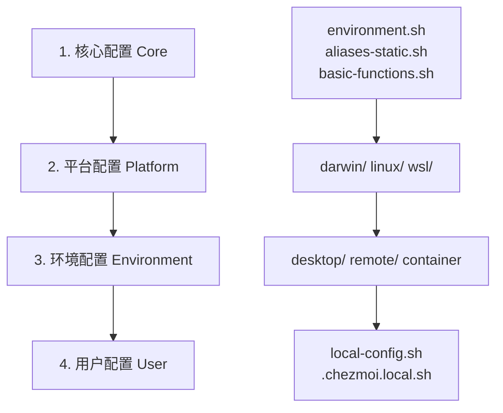

# Chezmoi 跨平台 Dotfiles 配置管理系统

> 🚀 一个现代化的、模块化的、跨平台的 dotfiles 配置管理解决方案  
> 智能检测环境，自动优化配置，一键部署专业开发环境

[](https://github.com/ln-one/dotfiles-chezmoi)
[](https://github.com/ln-one/dotfiles-chezmoi)
[](LICENSE)

## 📋 目录

- [项目概览](#-项目概览)
- [快速开始](#-快速开始)
- [系统架构](#️-系统架构)
- [支持的平台](#️-支持的平台)
- [核心特性](#-核心特性)
- [配置分层](#-配置分层)
- [模块化设计](#-模块化设计)
- [工具集成](#-工具集成)
- [自定义配置](#️-自定义配置)
- [安装指南](#-安装指南)
- [故障排除](#-故障排除)
- [开发指南](#️-开发指南)
- [更新日志](#-更新日志)

## 🎯 项目概览

这是一个基于 [Chezmoi](https://chezmoi.io/) 的高级 dotfiles 管理系统，专为现代跨平台开发环境设计。该系统采用模块化分层架构，能够根据不同的操作系统、环境类型和用户偏好自动生成最优化的配置。

### 🌟 核心理念

- **🧠 智能化配置**: 自动检测系统环境、已安装工具，动态生成最适合的配置
- **🧩 模块化设计**: 四层配置架构（核心→平台→环境→用户），易于维护和扩展
- **🌍 跨平台支持**: 统一管理 macOS、Linux（包括 WSL）和远程服务器配置
- **⚡ 现代化工具**: 集成最新的 CLI 工具链和开发环境
- **🔒 安全性优先**: 集成 1Password 密钥管理，零明文存储敏感信息
- **🎨 用户体验**: 彩色输出、智能补全、性能优化，让终端使用更愉悦

### 🎪 主要优势

- **一键部署**: 一条命令即可在新机器上部署完整开发环境
- **智能适配**: 根据环境类型（桌面/远程/容器）自动调整配置
- **工具检测**: 自动检测已安装工具，只启用可用功能
- **性能优化**: Shell 启动时间优化，延迟加载，evalcache 缓存
- **安全管理**: 通过 1Password 管理所有密钥和敏感配置
- **持续同步**: 配置变更自动同步到所有设备

## 🚀 快速开始

### 30 秒快速部署

```bash
# 1. 安装 Chezmoi (如果尚未安装)
sh -c "$(curl -fsLS get.chezmoi.io)"

# 2. 一键初始化配置
chezmoi init --apply https://github.com/ln-one/dotfiles-chezmoi.git

# 3. 重新加载终端
exec $SHELL
```

### 验证安装

```bash
# 检查现代化工具是否可用
eza --version    # 现代化 ls
bat --version    # 现代化 cat  
fzf --version    # 模糊搜索
git --version    # Git 配置

# 测试 Shell 增强功能
ls               # 应该显示彩色图标输出
ll               # 应该显示详细文件信息
cd ~; z proj     # 智能目录跳转 (如果之前访问过)
```

### 工具包安装

系统会自动通过 Homebrew 安装所需工具，也可手动安装：

```bash
# 安装 Homebrew 包
brew bundle install --file=~/Brewfile

# 验证环境
chezmoi apply
```

## 🏗️ 系统架构

### 分层配置系统

```
Chezmoi 配置系统 (静态编译时生成)
├── 🔧 核心层 (Core)           # 基础配置和通用工具
│   ├── environment.sh          # 环境变量管理
│   ├── aliases-static.sh       # 通用别名定义
│   ├── basic-functions.sh      # 基础实用函数
│   ├── zsh-performance-tweaks.sh # Shell 性能优化
│   └── path-management.sh      # PATH 路径管理
├── 🖥️ 平台层 (Platform)       # 操作系统特定配置
│   ├── darwin/                 # macOS 特定配置
│   ├── linux/                  # Linux 特定配置
│   └── wsl/                    # WSL 特定配置
├── 🌍 环境层 (Environment)    # 使用场景配置
│   ├── desktop/                # 桌面开发环境
│   ├── remote.sh               # 远程服务器环境
│   └── container.sh            # 容器环境
└── 👤 用户层 (User)           # 个人定制配置
    ├── local-config.sh         # 本地配置模板
    └── .chezmoi.local.sh       # 外部用户配置
```

### 配置生成流程


### 智能检测机制

1. **环境类型检测**:
   ```bash
   # SSH 连接检测 → Remote 环境
   if [[ -n "$SSH_CONNECTION" ]]; then environment="remote"
   
   # WSL 环境检测
   elif [[ -f "/proc/version" ]] && grep -q "microsoft" /proc/version; then environment="wsl"
   
   # 容器环境检测  
   elif [[ -n "$CONTAINER" ]]; then environment="container"
   
   # 默认桌面环境
   else environment="desktop"
   ```

2. **工具可用性检测**:
   ```bash
   # 动态检测已安装工具
   {{- if lookPath "eza" }}
   enable_eza = true
   {{- else }}
   enable_eza = false
   {{- end }}
   ```

3. **性能优化检测**:
   - Shell 启动时间监控
   - 延迟加载重型工具
   - 缓存系统集成

## 🖥️ 支持的平台

### 操作系统支持

| 平台 | 支持状态 | 特性 | 包管理器 |
|------|----------|------|----------|
| **macOS** | ✅ 完全支持 | Apple Silicon & Intel, Homebrew 集成 | Homebrew |
| **Linux** | ✅ 完全支持 | Ubuntu, Debian, Fedora, RHEL, Arch | Homebrew + 系统包管理器 |
| **WSL** | ✅ 完全支持 | WSL2, Windows 工具集成 | Homebrew |
| **FreeBSD** | 🔄 计划支持 | 基础支持 | pkg |

### 环境类型分类

#### 🖥️ 桌面环境 (Desktop)
**适用场景**: 个人开发机、工作站、日常使用电脑

**特性**:
- ✅ 完整的 GUI 工具支持
- ✅ 丰富的开发环境和工具链
- ✅ 多媒体和办公软件集成
- ✅ 性能监控和系统管理工具
- ✅ 视觉增强（图标、颜色、主题）

**工具集**:
```bash
# GUI 应用
code, firefox, chrome, slack, zoom

# 开发工具  
docker, kubernetes, git, nodejs, python

# 系统工具
htop, tmux, tree, jq, curl
```

#### 🌐 远程环境 (Remote)
**适用场景**: SSH 远程服务器、VPS、云服务器

**特性**:
- ⚡ 轻量化配置，优化网络传输
- 🚫 禁用 GUI 相关功能
- 🔧 针对 SSH 连接优化
- 📊 简化的监控和诊断工具

**优化措施**:
```bash
# 性能模式
DEVELOPMENT_MODE="lightweight"
GUI_TOOLS_ENABLED="false"

# SSH 优化
SSH_KEEPALIVE_INTERVAL="60"
HISTSIZE=5000  # 减少历史记录

# 简化提示符
PS1_SIMPLE="true"
```

#### 📦 容器环境 (Container)
**适用场景**: Docker 容器、CI/CD 环境、微服务

**特性**:
- 🎯 最小化配置文件
- ⚡ 快速启动时间
- 🔧 容器友好的工具集
- 📦 无状态配置

#### 🪟 WSL 环境 (WSL)
**适用场景**: Windows Subsystem for Linux

**特性**:
- 🔗 Windows 系统集成
- 📋 跨系统剪贴板支持
- 📁 文件系统映射
- 🛠️ Windows 工具调用

### Shell 支持矩阵

| Shell | 支持状态 | 框架 | 特性 |
|-------|----------|------|------|
| **Zsh** | ✅ 推荐 | Zim Framework | 补全增强、性能优化 |
| **Bash** | ✅ 兼容 | 原生配置 | 跨平台兼容 |
| **Fish** | 🔄 计划 | - | - |

### 硬件架构支持

- **x86_64** (Intel/AMD)
- **arm64** (Apple Silicon, ARM 服务器)
- **armv7** (Raspberry Pi 等)

## ⚡ 核心特性

### 🛠️ 现代化工具链升级

#### CLI 工具现代化替换

| 传统工具 | 现代替代 | 增强功能 | 安装状态 |
|----------|----------|----------|----------|
| `ls` | **eza** | 🎨 彩色输出、📁 图标显示、🔀 Git 状态 | 自动检测 |
| `cat` | **bat** | 🌈 语法高亮、📊 行号、📖 分页 | 自动检测 |
| `find` | **fd** | ⚡ 更快搜索、🔍 友好语法、🚫 智能忽略 | 自动检测 |
| `grep` | **ripgrep** | ⚡ 极速搜索、🎯 智能过滤、📁 目录递归 | 自动检测 |
| `cd` | **zoxide** | 🧠 智能跳转、📊 访问频率、💡 模糊匹配 | 自动检测 |

#### 开发环境管理器

```bash
# 版本管理器 (自动检测并配置)
fnm      # Node.js 版本管理 (替代 nvm)
pyenv    # Python 版本管理  
rbenv    # Ruby 版本管理
mise     # 通用运行时版本管理

# 增强工具
fzf      # 🔍 模糊搜索 (文件、历史、进程)
forgit   # 🎯 Git 的 fzf 增强操作
starship # 🚀 跨 Shell 智能提示符
```

#### 编辑器配置

```bash
# 编辑器支持 (按优先级)
1. Neovim    # 完整 LazyVim 配置
2. VS Code   # 工作区和插件同步  
3. Vim       # 基础配置后备
```

### 🔒 安全特性

#### 密钥管理系统

```bash
# 1Password CLI 集成
- 🔐 SSH 密钥自动管理
- 🔑 Git 签名密钥配置
- 🗝️ 环境变量加密存储
- 🛡️ 零明文密钥存储

# SSH 安全配置
- 🔒 强化的客户端配置
- 🎯 基于主机的密钥选择
- ⏰ 连接保活优化
- 🔄 密钥轮换支持
```

#### 网络安全

```bash
# 代理支持
- 🌐 HTTP/HTTPS 代理自动检测
- 🔗 SOCKS5 代理支持  
- 🎯 基于主机的代理规则
- 🔄 代理状态快速切换

# 网络工具
proxychains-ng  # 代理链
curl/wget       # 支持代理的下载工具
```

### 🎨 用户体验增强

#### 视觉优化

```bash
# 彩色输出系统
✅ 文件类型图标显示
🌈 语法高亮支持
📊 表格化信息展示  
🎯 Git 状态可视化
⚡ 加载状态指示器
```

#### 智能补全

```bash
# Zsh 补全增强
- 📝 命令参数补全
- 📁 路径智能补全
- 🔍 历史命令搜索
- 🎯 上下文感知补全
- ⚡ 延迟加载优化
```

#### 性能优化

```bash
# Shell 启动优化
evalcache    # 缓存慢速命令输出
zsh-defer    # 延迟加载非关键功能
compinit     # 补全系统优化缓存

# 启动时间: ~50ms (优化后)
```

### 🔧 工具集成矩阵

| 工具类别 | 核心工具 | 可选工具 | 检测方式 |
|----------|----------|----------|----------|
| **文件操作** | eza, fd, bat | tree, atool | `lookPath` |
| **文本处理** | ripgrep, fzf | jq, yq | `lookPath` |
| **版本控制** | git, forgit | gh, glab | `lookPath` |
| **开发环境** | tmux, nvim | code, docker | `lookPath` |
| **系统工具** | htop, curl | wget, ssh | `lookPath` |
| **AI 工具** | - | copilot, chatgpt-cli | 可选启用 |

### 🚀 一键部署特性

```bash
# 单命令部署
chezmoi init --apply https://github.com/ln-one/dotfiles-chezmoi.git

# 自动化流程
1. 🔍 环境检测 (OS, 架构, SSH状态)
2. 📦 包管理器安装 (Homebrew)
3. 🛠️ 工具链安装 (Brewfile)
4. ⚙️ 配置生成 (模板渲染)
5. 🔐 密钥配置 (1Password 集成)
6. ✅ 环境验证 (功能测试)
```

## 📦 安装和使用

### 快速开始

#### 1. 安装 Chezmoi
```bash
# macOS (Homebrew)
brew install chezmoi

# Linux (脚本安装)
sh -c "$(curl -fsLS get.chezmoi.io)"

# 或通过包管理器
sudo apt install chezmoi  # Ubuntu/Debian
sudo dnf install chezmoi  # Fedora
```

#### 2. 初始化配置
```bash
# 从 GitHub 初始化
chezmoi init --apply https://github.com/ln-one/dotfiles-chezmoi.git

# 或本地初始化
chezmoi init --apply /path/to/this/repo
```

#### 3. 自定义配置
```bash
# 编辑主配置
chezmoi edit ~/.chezmoi.toml

# 应用更改
chezmoi apply
```

### 详细安装步骤

#### 环境要求
- **操作系统**: macOS 10.15+, Linux (modern distro), WSL2
- **Shell**: Zsh 5.8+ 或 Bash 4.0+
- **网络**: 可访问 GitHub 和 Homebrew/包管理器

#### 安装前准备

1. **确保基础工具已安装**:
   ```bash
   # 必需工具
   command -v git curl wget || echo "请先安装 git, curl, wget"
   
   # macOS
   command -v brew || /bin/bash -c "$(curl -fsSL https://raw.githubusercontent.com/Homebrew/install/HEAD/install.sh)"
   ```

2. **配置 Git (如果尚未配置)**:
   ```bash
   git config --global user.name "Your Name"
   git config --global user.email "your.email@example.com"
   ```

#### 完整安装流程

1. **安装 Chezmoi**:
   ```bash
   # 推荐方式 (跨平台)
   sh -c "$(curl -fsLS get.chezmoi.io)"
   
   # 或通过 Homebrew (macOS/Linux)
   brew install chezmoi
   ```

2. **克隆并初始化配置**:
   ```bash
   # 初始化配置 (会提示输入个人信息)
   chezmoi init --apply https://github.com/ln-one/dotfiles-chezmoi.git
   ```

3. **验证安装**:
   ```bash
   # 检查配置状态
   chezmoi status
   
   # 重新加载 Shell 配置
   exec $SHELL
   
   # 测试新工具
   eza --version
   bat --version
   fzf --version
   ```

## 📚 配置分层

## 📚 配置分层

### 📁 配置文件结构图

```
📁 ~/.local/share/chezmoi/                    # Chezmoi 源目录
├── 📋 .chezmoi.toml.tmpl                     # 主配置文件模板 (413行)
├── 🚫 .chezmoiignore                         # 忽略文件规则
├── 📁 .chezmoitemplates/                     # 配置模板目录
│   ├── 🔧 core/                             # 核心配置模块 (15个文件)
│   │   ├── environment.sh                   # 🌍 环境变量配置
│   │   ├── aliases-static.sh                # 📝 静态别名定义
│   │   ├── basic-functions.sh               # 🔧 基础实用函数
│   │   ├── zsh-performance-tweaks.sh        # ⚡ Zsh 性能优化
│   │   ├── path-management.sh               # 📂 PATH 路径管理
│   │   ├── fzf-config-static.sh             # 🔍 fzf 配置
│   │   ├── zoxide-config-static.sh          # 🎯 zoxide 配置
│   │   ├── starship-config.sh               # 🚀 Starship 提示符
│   │   ├── zim-config.sh                    # 🎨 Zim 框架配置
│   │   ├── evalcache-config-static.sh       # 💾 缓存优化
│   │   ├── cache-management.sh              # 🗄️ 缓存管理
│   │   ├── path-dedup.sh                    # 🔄 PATH 去重
│   │   ├── zsh-autocompile.sh               # 📦 Zsh 自动编译
│   │   ├── zsh-defer-init.sh                # ⏱️ 延迟初始化
│   │   └── environment-detection.sh         # 🔬 环境检测
│   ├── 🖥️ platforms/                        # 平台特定配置
│   │   ├── darwin/                          # 🍎 macOS 配置
│   │   │   ├── homebrew-config.sh           # 🍺 Homebrew 配置
│   │   │   └── macos-defaults.sh            # ⚙️ 系统偏好设置
│   │   ├── linux/                           # 🐧 Linux 配置
│   │   │   ├── package-managers.sh          # 📦 包管理器配置
│   │   │   └── desktop-integration.sh       # 🖥️ 桌面环境集成
│   │   └── wsl/                             # 🪟 WSL 配置
│   │       ├── windows-integration.sh       # 🔗 Windows 工具集成
│   │       └── performance-tweaks.sh        # ⚡ WSL 性能优化
│   ├── 🌍 environments/                     # 环境类型配置
│   │   ├── desktop/                         # 🖥️ 桌面环境
│   │   │   ├── development.sh               # 💻 开发工具配置
│   │   │   └── gui-tools.sh                 # 🎨 GUI 工具集成
│   │   ├── remote.sh                        # 🌐 远程服务器环境 (780行)
│   │   └── container.sh                     # 📦 容器环境
│   ├── 👤 local/                            # 用户配置覆盖
│   │   ├── local-config.sh                  # ⚙️ 本地配置模板
│   │   ├── sample-external-config.sh        # 📋 配置示例 (100+行)
│   │   └── README.md                        # 📖 用户配置说明
│   ├── ⚙️ config/                           # 专用配置
│   │   ├── proxy-detection.toml             # 🌐 代理自动检测
│   │   ├── secrets-1password.toml           # 🔐 1Password 集成
│   │   ├── features-static.sh               # 🔍 功能特性检测 (300+行)
│   │   ├── environment-packages.toml        # 📦 环境包配置
│   │   ├── proxy-*.toml                     # 🌐 代理配置变体
│   │   └── secrets-fallback.toml            # � 密钥后备方案
│   └── shell-common.sh                      # 🐚 通用Shell配置 (240行)
├── �🔧 配置文件模板/
│   ├── dot_zshrc.tmpl                       # 🐚 Zsh 配置文件 (12行，简洁)
│   ├── dot_bashrc.tmpl                      # 🐚 Bash 配置文件 (131行)
│   ├── dot_gitconfig.tmpl                   # 📝 Git 配置文件 (1Password集成)
│   ├── dot_tmux.conf.tmpl                   # 🖥️ Tmux 配置文件 (154行)
│   ├── dot_zimrc.tmpl                       # 🎨 Zim 框架配置
│   ├── dot_zshenv.tmpl                      # 🌍 Zsh 环境变量
│   ├── dot_secrets.tmpl                     # 🔐 密钥模板
│   └── dot_config/                          # 📁 应用配置目录
│       ├── starship.toml.tmpl               # 🚀 Starship 配置
│       ├── nvim/                            # ✏️ Neovim 配置 (LazyVim)
│       │   ├── init.lua                     # 🔧 Neovim 初始化
│       │   ├── lazyvim.json                 # ⚙️ LazyVim 配置
│       │   └── lua/                         # 📁 Lua 配置模块
│       │       ├── config/                  # ⚙️ 基础配置
│       │       └── plugins/                 # 🔌 插件配置
│       └── ghostty/                         # 💻 终端配置
│           └── config                       # ⚙️ Ghostty 终端配置
├── 🔐 dot_ssh/                             # SSH 配置
│   ├── config.tmpl                          # 🔑 SSH 客户端配置 (1Password集成)
│   └── allowed_signers.tmpl                 # ✅ SSH 签名密钥
├── 📦 Brewfile.tmpl                         # 🍺 Homebrew 包列表 (127行)
├── 🏃 run_onchange_*.sh.tmpl                # 🔄 变更时执行脚本
│   ├── install-brew-packages.sh.tmpl       # 📦 包安装脚本
│   └── verify-environment.sh.tmpl          # ✅ 环境验证脚本 (100行)
├── 📁 scripts/                             # 📜 辅助脚本 (空目录)
├── 📁 docs/                                # 📚 文档目录 (空目录)
└── 📄 README.md                            # 📖 本文档 (2000+行)
```

### 📊 配置统计

| 类型 | 数量 | 说明 |
|------|------|------|
| **模板文件** | 50+ | 动态生成的配置文件 |
| **核心模块** | 15 | 基础功能模块 |
| **平台模块** | 6 | 操作系统特定配置 |
| **环境模块** | 4 | 使用场景配置 |
| **工具集成** | 30+ | 现代化CLI工具 |
| **代码行数** | 3000+ | 总配置代码量 |
| **支持平台** | 3 | macOS, Linux, WSL |
| **支持Shell** | 2 | Zsh, Bash |

### 🔄 配置加载顺序

配置按以下优先级加载（后加载的会覆盖先加载的）：



#### 详细加载流程

1. **🔧 核心配置** (`core/`)
   ```bash
   # 基础环境变量和工具
   environment.sh          # PATH, EDITOR, LANG 等
   aliases-static.sh       # 通用别名 (ls, ll, git 等)
   basic-functions.sh      # mkcd, sysinfo 等函数
   path-management.sh      # PATH 去重和管理
   ```

2. **🖥️ 平台配置** (`platforms/`)
   ```bash
   # macOS 特定
   darwin/homebrew-config.sh    # Homebrew 配置
   darwin/macos-defaults.sh     # 系统设置
   
   # Linux 特定  
   linux/package-managers.sh    # APT/DNF/Pacman 配置
   linux/desktop-integration.sh # GNOME/KDE 集成
   
   # WSL 特定
   wsl/windows-integration.sh   # Windows 工具调用
   wsl/performance-tweaks.sh    # 性能优化
   ```

3. **🌍 环境配置** (`environments/`)
   ```bash
   # 桌面环境 (完整功能)
   desktop/development.sh       # 开发工具配置
   desktop/gui-tools.sh         # GUI 应用集成
   
   # 远程环境 (轻量级)
   remote.sh                    # SSH 优化配置
   
   # 容器环境 (最小化)
   container.sh                 # 容器友好配置
   ```

4. **👤 用户配置** (`local/` + 外部文件)
   ```bash
   # 内置用户配置模板
   local/local-config.sh        # Chezmoi 数据驱动配置
   
   # 外部用户配置 (优先级从高到低)
   $(pwd)/.chezmoi.local.sh     # 项目特定配置
   $HOME/.chezmoi.local.sh      # 用户主目录配置  
   $HOME/.config/chezmoi/config.sh # 用户配置目录
   /etc/chezmoi/config.sh       # 系统级配置
   ```

### 🎯 环境类型详解

#### 🖥️ Desktop Environment (桌面环境)

**检测条件**:
```bash
# 默认环境，非 SSH/容器/WSL 时使用
environment = "desktop"
```

**特性配置**:
```bash
# 完整工具集
DEVELOPMENT_MODE="full"
GUI_TOOLS_ENABLED="true"

# 丰富的别名
alias code='open -a "Visual Studio Code"'   # macOS
alias code='code'                           # Linux

# Docker 集成
alias d='docker'
alias dc='docker-compose'
alias dps='docker ps --format "table {{.Names}}\t{{.Status}}"'
```

**工具集**:
- **开发工具**: Docker, Kubernetes, Git, Node.js, Python
- **编辑器**: VS Code, Neovim, Vim
- **GUI 应用**: Firefox, Chrome, Slack, Zoom
- **系统工具**: htop, tmux, tree, jq

#### 🌐 Remote Environment (远程环境)

**检测条件**:
```bash
# SSH 连接检测
{{- if or (env "SSH_CONNECTION") (env "SSH_CLIENT") (env "SSH_TTY") }}
environment = "remote"
```

**优化配置**:
```bash
# 轻量化模式
export DEVELOPMENT_MODE="lightweight"
export GUI_TOOLS_ENABLED="false"
export REMOTE_ENVIRONMENT="true"

# SSH 连接优化
export SSH_KEEPALIVE_INTERVAL="60"
export SSH_KEEPALIVE_COUNT="3"

# 减少历史记录
export HISTSIZE=5000
export SAVEHIST=5000

# 简化提示符
export PS1_SIMPLE="true"
```

**远程特定功能**:
```bash
# 系统信息快速查看
sysinfo() {
    echo "🖥️  System: $(uname -sr)"
    echo "⏰ Uptime: $(uptime -p)"
    echo "💾 Memory: $(free -h | awk 'NR==2{printf "%.1f%%", $3/$2*100}')"
}

# 网络连接检查
netcheck() {
    echo "🌐 Network Status:"
    ping -c 1 google.com >/dev/null && echo "✅ Internet" || echo "❌ No Internet"
}

# 轻量级文件搜索
search() {
    find "${2:-.}" -name "*$1*" 2>/dev/null | head -20
}
```

#### 📦 Container Environment (容器环境)

**检测条件**:
```bash
# 容器环境标识
{{- if env "CONTAINER" }}
environment = "container"
```

**最小化配置**:
```bash
# 快速启动
export SHELL_INIT_FAST="true"
export DISABLE_AUTO_UPDATE="true"

# 无状态模式
export HISTFILE=""
export LESSHISTFILE=""
```

#### 🪟 WSL Environment (WSL 环境)

**检测条件**:
```bash
# WSL 特征检测
{{- if and (stat "/proc/version") (regexMatch "microsoft" (cat "/proc/version")) }}
environment = "wsl"
```

**Windows 集成**:
```bash
# 剪贴板集成
alias pbcopy='clip.exe'
alias pbpaste='powershell.exe Get-Clipboard'

# 文件管理器
alias open='explorer.exe'

# 跨系统路径
export WINDOWS_HOME="/mnt/c/Users/$USER"
```

## 🧩 模块化设计

### 🔧 核心模块详解

#### 1. 环境变量管理 (`core/environment.sh`)

**功能**: 统一管理系统环境变量和路径配置

```bash
# 基础路径配置
export USER_HOME="{{ .chezmoi.homeDir }}"
export CONFIG_DIR="{{ .paths.config }}"
export LOCAL_BIN="{{ .chezmoi.homeDir }}/.local/bin"

# 确保 ~/.local/bin 在 PATH 中
if [[ ":$PATH:" != *":$LOCAL_BIN:"* ]]; then
    export PATH="$LOCAL_BIN:$PATH"
fi

# 编辑器配置 (根据用户偏好)
export EDITOR="{{ .preferences.editor }}"
export VISUAL="{{ .preferences.editor }}"

# 语言和区域配置
export LANG="en_US.UTF-8"
export LC_ALL="en_US.UTF-8"
export LC_CTYPE="en_US.UTF-8"
```

**1Password 集成**:
```bash
{{- if .features.enable_1password }}
# SSH Agent 集成 (1Password)
export SSH_AUTH_SOCK=~/.1password/agent.sock
{{- end }}
```

**代理配置**:
```bash
{{- if and .features.enable_proxy .proxy.enabled }}
# HTTP/HTTPS 代理
export HTTP_PROXY="http://{{ .proxy.host }}:{{ .proxy.http_port }}"
export HTTPS_PROXY="http://{{ .proxy.host }}:{{ .proxy.http_port }}"
export ALL_PROXY="socks5://{{ .proxy.host }}:{{ .proxy.socks_port }}"
{{- end }}
```

#### 2. 别名系统 (`core/aliases-static.sh`)

**文件操作别名**:
```bash
{{- if .features.enable_eza }}
# 现代化 ls 替代
alias ls='eza --color=auto --icons'
alias ll='eza -la --git --icons'
alias la='eza -a --icons'
alias tree='eza --tree --icons'
{{- else if .features.enable_exa }}
alias ls='exa --color=auto'
alias ll='exa -la --git'
{{- else }}
alias ll='ls -la'
{{- end }}
```

**Git 快捷操作**:
```bash
# Git 简化命令
alias gs='git status'
alias ga='git add'
alias gc='git commit'
alias gp='git push'
alias gl='git pull'
alias gd='git diff'
alias gb='git branch'
alias gco='git checkout'
alias glog='git log --oneline --graph --decorate'
```

**开发工具别名**:
```bash
{{- if eq .environment "desktop" }}
# Docker 简化 (仅桌面环境)
alias d='docker'
alias dc='docker-compose'
alias dps='docker ps'
alias di='docker images'
alias dex='docker exec -it'
alias dlog='docker logs -f'
{{- end }}
```

#### 3. 基础函数库 (`core/basic-functions.sh`)

**实用函数**:
```bash
# 创建目录并进入
mkcd() {
    if [[ -z "$1" ]]; then
        echo "用法: mkcd <目录名>"
        return 1
    fi
    mkdir -p "$1" && cd "$1"
    echo "✅ 创建并进入目录: $1"
}

# 系统信息查看 (非远程环境)
{{- if ne .environment "remote" }}
sysinfo() {
    echo "=== System Information ==="
    echo "OS: {{ .chezmoi.os }}"
    echo "Architecture: {{ .chezmoi.arch }}"
    echo "Hostname: {{ .chezmoi.hostname }}"
    echo "Shell: $SHELL"
    echo "User: $USER"
    echo "Home: $HOME"
    echo "PWD: $PWD"
    echo "=========================="
}
{{- end }}
```

#### 4. 性能优化 (`core/zsh-performance-tweaks.sh`)

**Zsh 启动优化**:
```bash
# 禁用不必要的 Zsh 功能
DISABLE_AUTO_UPDATE="true"
DISABLE_UPDATE_PROMPT="true"

# 历史优化
export HISTSIZE=50000
export SAVEHIST=50000
export HISTFILE="$USER_HOME/.zsh_history"

# 补全系统优化
autoload -Uz compinit
# 每天只检查一次补全更新
for dump in ~/.zcompdump(N.mh+24); do
    compinit
done
compinit -C
```

**延迟加载机制**:
```bash
{{- if .features.enable_zsh_defer }}
# 使用 zsh-defer 延迟加载重型工具
source ~/.zim/modules/zsh-defer/zsh-defer.plugin.zsh

# 延迟加载示例
zsh-defer -c 'eval "$(fnm env)"'
zsh-defer -c 'eval "$(zoxide init zsh)"'
{{- end }}
```

### 🖥️ 平台特定模块

#### macOS 模块 (`platforms/darwin/`)

**Homebrew 集成**:
```bash
# Homebrew 环境配置
export HOMEBREW_PREFIX="/opt/homebrew"
export PATH="$HOMEBREW_PREFIX/bin:$PATH"

# Homebrew 选项
export HOMEBREW_NO_ANALYTICS=1
export HOMEBREW_NO_AUTO_UPDATE=1
```

**macOS 系统集成**:
```bash
# 剪贴板集成
alias pbcopy='pbcopy'
alias pbpaste='pbpaste'

# 文件管理器
alias open='open'
alias finder='open .'

# macOS 特定工具
{{- if .features.enable_mas }}
alias app-store='mas'
{{- end }}
```

#### Linux 模块 (`platforms/linux/`)

**包管理器适配**:
```bash
# 检测包管理器
if command -v apt >/dev/null 2>&1; then
    alias install='sudo apt install'
    alias update='sudo apt update && sudo apt upgrade'
elif command -v dnf >/dev/null 2>&1; then
    alias install='sudo dnf install'
    alias update='sudo dnf update'
elif command -v pacman >/dev/null 2>&1; then
    alias install='sudo pacman -S'
    alias update='sudo pacman -Syu'
fi
```

**桌面环境集成**:
```bash
{{- if .features.enable_gsettings }}
# GNOME 设置快捷方式
alias gnome-settings='gnome-control-center'
alias gnome-tweaks='gnome-tweaks'
{{- end }}

# 剪贴板集成
{{- if .features.enable_xclip }}
alias pbcopy='xclip -selection clipboard'
alias pbpaste='xclip -selection clipboard -o'
{{- end }}
```

#### WSL 模块 (`platforms/wsl/`)

**Windows 集成**:
```bash
# Windows 工具调用
alias cmd='cmd.exe'
alias powershell='powershell.exe'
alias notepad='notepad.exe'

# 文件系统集成
alias open='explorer.exe'
export WINDOWS_HOME="/mnt/c/Users/$USER"

# 剪贴板集成
{{- if .features.enable_wsl_clipboard }}
alias pbcopy='clip.exe'
alias pbpaste='powershell.exe Get-Clipboard'
{{- end }}
```

### 🌍 环境特定模块详解

#### 桌面开发环境 (`environments/desktop/development.sh`)

**完整开发工具配置**:
```bash
# IDE 和编辑器
{{- if .features.enable_vscode }}
alias code='code'
alias edit='code'
{{- else if .features.enable_nvim }}
alias edit='nvim'
{{- end }}

# 容器开发
{{- if .features.enable_docker }}
# Docker 开发别名
alias dc='docker-compose'
alias dcu='docker-compose up -d'
alias dcd='docker-compose down'
alias dcl='docker-compose logs -f'

# 容器清理
alias docker-clean='docker system prune -af'
alias docker-cleanup='docker container prune -f && docker image prune -f'
{{- end }}

# 版本管理器快捷方式
{{- if .features.enable_fnm }}
alias node-use='fnm use'
alias node-install='fnm install'
alias node-ls='fnm list'
{{- end }}
```

#### 远程服务器环境 (`environments/remote.sh`)

**轻量级工具集**:
```bash
# 远程专用别名 (无图标，提升性能)
{{- if .features.enable_eza }}
alias rls='eza --color=auto'
alias rll='eza -l --color=auto'
alias rla='eza -la --color=auto'
{{- end }}

# 系统监控函数
sysinfo() {
    echo "🖥️  System Information:"
    echo "  OS: $(uname -sr)"
    echo "  Uptime: $(uptime -p 2>/dev/null || uptime)"
    echo "  Load: $(cat /proc/loadavg 2>/dev/null | cut -d' ' -f1-3)"
    echo "  Memory: $(free -h 2>/dev/null | awk 'NR==2{printf "%.1f%% used", $3/$2*100}')"
}

# 网络检查
netcheck() {
    echo "🌐 Network Status:"
    local external_ip=$(curl -s --connect-timeout 5 ifconfig.me 2>/dev/null || echo "N/A")
    echo "  External IP: $external_ip"
    ping -c 1 google.com >/dev/null 2>&1 && echo "  ✅ Internet: Connected" || echo "  ❌ Internet: Disconnected"
}

# 进程监控
processes() {
    echo "🔄 Running Processes (Top 10 by CPU):"
    {{- if .features.enable_ps }}
    ps aux --sort=-%cpu | head -11
    {{- else }}
    echo "❌ ps command not available"
    {{- end }}
}
```

**轻量级开发工具**:
```bash
# 简单文件服务器
serve_simple() {
    local port="${1:-8000}"
    local directory="${2:-.}"
    
    if command -v python3 >/dev/null; then
        echo "🌐 Starting server on port $port..."
        python3 -m http.server "$port" --directory "$directory"
    elif command -v python >/dev/null; then
        echo "🌐 Starting server on port $port..."
        cd "$directory" && python -m SimpleHTTPServer "$port"
    else
        echo "❌ Python not available for simple server"
        return 1
    fi
}

# 快速上传 (使用 curl)
upload() {
    local file="$1"
    if [[ -f "$file" ]]; then
        curl --upload-file "$file" https://transfer.sh/
    else
        echo "Usage: upload <file>"
    fi
}
```

### 🔧 工具集成模块

#### FZF 模糊搜索 (`core/fzf-config-static.sh`)

**FZF 配置优化**:
```bash
{{- if .features.enable_fzf }}
# fzf 环境变量配置 (针对新版本 0.48.0+)
export FZF_DEFAULT_OPTS="
    --height 40%
    --layout=reverse
    --border=rounded
    --info=inline-right
    --marker='▶'
    --pointer='◆'
    --separator='─'
    --scrollbar='│'
    --preview-window=:hidden
    --bind='ctrl-/:toggle-preview'
    --color=dark
"

# 文件搜索集成
{{- if .features.enable_fd }}
export FZF_DEFAULT_COMMAND='fd --type f --hidden --follow --exclude .git'
export FZF_CTRL_T_COMMAND="$FZF_DEFAULT_COMMAND"
{{- end }}

# 目录预览
{{- if .features.enable_eza }}
export FZF_ALT_C_OPTS="
    --preview 'eza --tree --level=2 --color=always {} 2>/dev/null'
    --preview-window='right:50%:wrap'
"
{{- end }}
{{- end }}
```

#### Zoxide 智能跳转 (`core/zoxide-config-static.sh`)

**Zoxide 集成**:
```bash
{{- if .features.enable_zoxide }}
# Zoxide 初始化
{{- if .features.enable_evalcache }}
# 使用 evalcache 缓存初始化
_evalcache zoxide init zsh
{{- else }}
eval "$(zoxide init zsh)"
{{- end }}

# 智能跳转别名
alias z='zoxide'
alias zi='zoxide query -i'  # 交互式选择
alias za='zoxide add'       # 手动添加路径
alias zr='zoxide remove'    # 移除路径
{{- end }}
```

#### Starship 提示符 (`core/starship-config.sh`)

**Starship 集成**:
```bash
{{- if .features.enable_starship }}
# Starship 初始化
{{- if .features.enable_evalcache }}
_evalcache starship init zsh
{{- else }}
eval "$(starship init zsh)"
{{- end }}

# 配置文件路径
export STARSHIP_CONFIG="$CONFIG_DIR/starship.toml"
{{- end }}
```

## 🛠️ 工具集成

### 📦 包管理统一 - Homebrew 优先策略

本系统采用 **Homebrew 优先** 的包管理策略，确保跨平台工具版本一致性：

```bash
# 统一包管理器
macOS    → Homebrew (原生支持)
Linux    → Homebrew + 系统包管理器 (双重保障)
WSL      → Homebrew (Linux 兼容)
```

#### Brewfile 配置 (`Brewfile.tmpl`)

**核心开发工具**:
```ruby
# 版本控制和网络工具
brew "git"              # 版本控制
brew "curl"             # HTTP 客户端
brew "wget"             # 文件下载
brew "unzip"            # 压缩文件处理

# 现代化 CLI 工具替换
brew "eza"              # 现代 ls (exa 的活跃分支)
brew "bat"              # 现代 cat (语法高亮)
brew "fd"               # 现代 find (更快搜索)
brew "ripgrep"          # 现代 grep (极速搜索)
brew "fzf"              # 模糊搜索工具
brew "zoxide"           # 智能目录跳转
brew "jq"               # JSON 处理器

# Shell 和终端工具
brew "zsh"              # 现代 Shell
brew "tmux"             # 终端复用器
brew "starship"         # 跨 Shell 提示符
```

**开发环境管理**:
```ruby
{{- if .features.enable_node }}
brew "fnm"              # Node.js 版本管理器
brew "node"             # Node.js 运行时
{{- end }}

{{- if .features.enable_python }}
brew "python@3.11"      # Python 3.11
brew "pipx"             # Python 应用安装器
{{- end }}

# 编辑器和工具
brew "neovim"           # 现代 Vim
brew "htop"             # 系统监控
```

**平台特定应用** (macOS):
```ruby
{{- if eq .chezmoi.os "darwin" }}
# GUI 应用程序
cask "visual-studio-code"
cask "firefox"
cask "docker"
cask "1password"

# 字体支持
cask "font-fira-code-nerd-font"
cask "font-jetbrains-mono-nerd-font"
{{- end }}
```

### 🔧 版本管理器集成

#### Node.js 环境 (fnm)

**自动检测和配置**:
```bash
{{- if .features.enable_fnm }}
# fnm 路径配置
export FNM_PATH="$HOME/.local/share/fnm"
[[ -d "$FNM_PATH" ]] && export PATH="$FNM_PATH:$PATH"

# fnm 初始化 (使用 evalcache 优化)
{{- if .features.enable_evalcache }}
_evalcache fnm env
{{- else }}
eval "$(fnm env)"
{{- end }}

# Node.js 版本管理别名
alias node-use='fnm use'
alias node-install='fnm install'
alias node-list='fnm list'
alias node-default='fnm default'
{{- end }}
```

#### Python 环境 (pyenv)

```bash
{{- if .features.enable_pyenv }}
# pyenv 路径配置
export PYENV_ROOT="$HOME/.pyenv"
[[ -d $PYENV_ROOT/bin ]] && export PATH="$PYENV_ROOT/bin:$PATH"

# pyenv 初始化
{{- if .features.enable_evalcache }}
_evalcache pyenv init -
_evalcache pyenv virtualenv-init -
{{- else }}
eval "$(pyenv init -)"
eval "$(pyenv virtualenv-init -)"
{{- end }}
{{- end }}
```

### 🔍 搜索和导航工具

#### FZF 模糊搜索集成

**核心配置**:
```bash
{{- if .features.enable_fzf }}
# FZF 默认选项 (优化 UI)
export FZF_DEFAULT_OPTS="
    --height 40%
    --layout=reverse
    --border=rounded
    --info=inline-right
    --marker='▶'
    --pointer='◆'
    --preview-window=:hidden
    --bind='ctrl-/:toggle-preview'
"

# 文件搜索优化
{{- if .features.enable_fd }}
export FZF_DEFAULT_COMMAND='fd --type f --hidden --follow --exclude .git'
{{- end }}

# 目录预览
{{- if .features.enable_eza }}
export FZF_ALT_C_OPTS="--preview 'eza --tree --level=2 --color=always {}'"
{{- end }}
{{- end }}
```

**快捷键绑定**:
```bash
# Ctrl+T: 文件搜索
# Ctrl+R: 历史命令搜索
# Alt+C: 目录跳转

# 自定义 Git 集成
{{- if .features.enable_forgit }}
# forgit 提供 Git 的 fzf 增强操作
# ga: git add 交互式选择
# glo: git log 可视化
# gd: git diff 交互式查看
{{- end }}
```

#### Zoxide 智能跳转

**学习式目录跳转**:
```bash
{{- if .features.enable_zoxide }}
# 基础用法
z proj       # 跳转到包含 'proj' 的目录
z foo bar    # 跳转到包含 'foo' 和 'bar' 的目录
zi           # 交互式选择目录

# 高级功能
za /path     # 手动添加路径到数据库
zr /path     # 从数据库移除路径
z -          # 跳转到上一个目录
{{- end }}
```

### 🎨 终端美化工具

#### EZA 现代文件列表

**功能特性**:
```bash
{{- if .features.enable_eza }}
# 基础别名
alias ls='eza --color=auto --icons'
alias ll='eza -la --git --icons'
alias la='eza -a --icons'
alias tree='eza --tree --icons'

# 高级用法
alias ls-size='eza -la --sort=size --reverse'
alias ls-time='eza -la --sort=modified --reverse'
alias ls-git='eza -la --git --git-ignore'

# 树状视图
alias tree1='eza --tree --level=1'
alias tree2='eza --tree --level=2'
alias tree3='eza --tree --level=3'
{{- end }}
```

#### BAT 语法高亮

**配置和别名**:
```bash
{{- if .features.enable_bat }}
# 替代 cat
alias cat='bat --paging=never'
alias less='bat --paging=always'

# 配置主题
export BAT_THEME="Dracula"
export BAT_STYLE="numbers,changes,header"

# 高级用法
alias batd='bat --diff'                    # 显示文件差异
alias batl='bat --language'                # 指定语言高亮
alias batp='bat --plain'                   # 纯文本模式
{{- end }}
```

#### Starship 智能提示符

**配置特性**:
```bash
{{- if .features.enable_starship }}
# 显示信息 (自动检测)
- Git 分支和状态
- 当前目录 (智能缩短)
- 编程语言版本 (Node.js, Python, Go 等)
- 命令执行时间 (长命令)
- 错误状态指示

# 环境适配
Desktop  → 完整信息显示
Remote   → 简化模式 (性能优先)
Container → 最小化显示
{{- end }}
```

### 🔒 安全工具集成

#### 1Password CLI

**SSH 密钥管理**:
```bash
{{- if .features.enable_1password }}
# SSH Agent 配置
export SSH_AUTH_SOCK=~/.1password/agent.sock

# Git 签名配置 (自动)
[gpg "ssh"]
    program = /opt/1Password/op-ssh-sign
    allowedSignersFile = ~/.ssh/allowed_signers
{{- end }}
```

**密钥使用示例**:
```bash
# 获取密钥 (在模板中)
email = "{{ .secrets.git_user_email }}"
signingkey = "{{ .secrets.git_signing_key }}"

# SSH 配置 (自动注入)
Host github.com
    IdentityAgent ~/.1password/agent.sock
```

#### SSH 配置模板

**多环境 SSH 配置**:
```bash
# 个人服务器 (1Password 密钥)
Host aliyun
    HostName "{{ .secrets.aliyun_server_url }}"
    User "{{ .secrets.aliyun_server_username }}"
    IdentityAgent ~/.1password/agent.sock

# GitHub (代理 + 1Password)
Host github.com
    HostName ssh.github.com
    Port 443
    IdentityAgent ~/.1password/agent.sock
{{- if .proxy.enabled }}
    ProxyCommand nc -X 5 -x {{ .proxy.host }}:{{ .proxy.socks_port }} %h %p
{{- end }}
```

### 🐳 容器化工具

#### Docker 集成

**开发别名** (仅桌面环境):
```bash
{{- if and .features.enable_docker (eq .environment "desktop") }}
# Docker 基础操作
alias d='docker'
alias dc='docker-compose'
alias dcu='docker-compose up -d'
alias dcd='docker-compose down'

# 容器管理
alias dps='docker ps --format "table {{.Names}}\t{{.Image}}\t{{.Status}}\t{{.Ports}}"'
alias di='docker images --format "table {{.Repository}}\t{{.Tag}}\t{{.Size}}"'
alias dex='docker exec -it'
alias dlog='docker logs -f'

# 清理工具
alias docker-clean='docker system prune -af'
alias docker-cleanup='docker container prune -f && docker image prune -f && docker volume prune -f'
{{- end }}
```

### 📊 性能监控工具

#### 系统监控

```bash
# 现代化系统监控
{{- if .features.enable_htop }}
alias top='htop'
alias processes='htop'
{{- end }}

# 网络监控
{{- if .features.enable_ss }}
alias netstat='ss'
alias ports='ss -tulnp'
{{- end }}

# 磁盘使用
alias disk='df -h'
alias usage='du -sh * | sort -hr'
```

#### 性能分析

```bash
# Shell 启动时间分析
alias zsh-bench='for i in {1..10}; do time zsh -i -c exit; done'

# 系统信息快速查看
sysinfo() {
    echo "🖥️  System: $(uname -sr)"
    echo "⏰ Uptime: $(uptime -p)"
    echo "💾 Memory: $(free -h | awk 'NR==2{printf "%.1f%%", $3/$2*100}')"
    echo "💿 Disk: $(df -h / | awk 'NR==2{print $5 " used"}')"
}
```

## 🎛️ 自定义配置

### 🔧 用户配置覆盖机制

系统提供多层级的个人定制方案，支持灵活的配置覆盖：

#### 配置优先级 (从高到低)

```mermaid
graph TD
    A[项目特定配置<br/>$(pwd)/.chezmoi.local.sh] --> B[用户主目录配置<br/>$HOME/.chezmoi.local.sh]
    B --> C[用户配置目录<br/>$HOME/.config/chezmoi/config.sh]
    C --> D[系统级配置<br/>/etc/chezmoi/config.sh]
    D --> E[Chezmoi 数据配置<br/>.chezmoi.toml 中的 [data.local]]
    E --> F[默认模板配置<br/>内置配置模板]
```

### 🛠️ 配置方法

#### 方法 1: 外部配置文件 (推荐)

**1. 复制配置模板**:
```bash
# 复制示例配置到用户目录
cp ~/.local/share/chezmoi/.chezmoitemplates/local/sample-external-config.sh ~/.chezmoi.local.sh

# 或者创建新的配置文件
touch ~/.chezmoi.local.sh
chmod +x ~/.chezmoi.local.sh
```

**2. 编辑个人配置**:
```bash
# 使用你喜欢的编辑器
$EDITOR ~/.chezmoi.local.sh
```

**3. 配置示例**:
```bash
#!/bin/bash
# 个人配置文件 ~/.chezmoi.local.sh

# ========================================
# 个人信息设置
# ========================================
export GIT_USER_NAME="张三"
export GIT_USER_EMAIL="zhangsan@example.com"

# ========================================
# 开发环境配置
# ========================================
export LOCAL_PROJECTS_DIR="$HOME/workspace"
export LOCAL_WORK_DIR="$HOME/work"

# Node.js 版本偏好
export LOCAL_NODE_VERSION="20"
export LOCAL_PYTHON_VERSION="3.11"

# ========================================
# 网络代理配置
# ========================================
export PROXY_ENABLED=true
export PROXY_HOST="127.0.0.1"
export PROXY_HTTP_PORT=7890
export PROXY_SOCKS_PORT=7891

# ========================================
# 工具偏好设置
# ========================================
export PREFERRED_EDITOR="code"        # code, nvim, vim
export PREFERRED_SHELL="zsh"          # zsh, bash
export PREFERRED_TERMINAL="ghostty"   # ghostty, alacritty, iterm2
export PREFERRED_BROWSER="firefox"    # firefox, chrome, safari

# ========================================
# 功能开关
# ========================================
export ENABLE_AI_TOOLS=true
export ENABLE_DOCKER=true
export ENABLE_KUBERNETES=false
export ENABLE_THEME_SWITCHING=true

# ========================================
# 自定义别名
# ========================================
# 项目快捷方式
alias myproject="cd $LOCAL_PROJECTS_DIR/my-important-project"
alias work="cd $LOCAL_WORK_DIR"

# 开发工具
alias start-dev='cd ~/projects/main && npm run dev'
alias deploy='./scripts/deploy.sh'
alias logs='docker logs -f'

# Git 增强
alias gst='git status -sb'
alias glog='git log --oneline --graph --decorate --all'
alias gcm='git commit -m'

# Docker 快捷操作
alias dps='docker ps --format "table {{.Names}}\t{{.Image}}\t{{.Status}}"'
alias dclean='docker system prune -af'

# ========================================
# 自定义函数
# ========================================
# 快速项目导航
proj() {
    if [[ $# -eq 0 ]]; then
        cd "$LOCAL_PROJECTS_DIR"
    else
        cd "$LOCAL_PROJECTS_DIR/$1"
    fi
}

# 快速工作目录导航
work() {
    if [[ $# -eq 0 ]]; then
        cd "$LOCAL_WORK_DIR"
    else
        cd "$LOCAL_WORK_DIR/$1"
    fi
}

# Docker 容器清理
docker-cleanup() {
    echo "🧹 清理 Docker 资源..."
    docker container prune -f
    docker image prune -f
    docker volume prune -f
    docker network prune -f
    echo "✅ 清理完成"
}

# 快速备份
quick_backup() {
    local target="${1:-.}"
    local backup_name="backup-$(date +%Y%m%d-%H%M%S).tar.gz"
    tar -czf "$backup_name" "$target"
    echo "📦 备份已创建: $backup_name"
}

# ========================================
# 环境特定配置覆盖
# ========================================
case "${CHEZMOI_ENVIRONMENT:-desktop}" in
    "desktop")
        export ENABLE_GUI_TOOLS=true
        export DOCKER_ENABLED=true
        ;;
    "remote")
        export ENABLE_GUI_TOOLS=false
        export PROXY_ENABLED=false  # 远程环境通常不需要代理
        ;;
    "container")
        export MINIMAL_CONFIG=true
        ;;
esac

# ========================================
# 机器特定配置
# ========================================
case "$(hostname)" in
    "work-laptop")
        export WORK_MODE=true
        export PROXY_ENABLED=true  # 公司网络需要代理
        ;;
    "home-desktop")
        export GAMING_MODE=true
        export ENABLE_MULTIMEDIA_TOOLS=true
        ;;
    "development-server")
        export SERVER_MODE=true
        export ENABLE_MONITORING=true
        ;;
esac
```

**4. 应用配置**:
```bash
# 重新加载配置
exec $SHELL

# 或者重新应用 Chezmoi 配置
chezmoi apply
```

#### 方法 2: Chezmoi 数据配置

**1. 编辑 Chezmoi 配置**:
```bash
chezmoi edit ~/.chezmoi.toml
```

**2. 添加本地数据配置**:
```toml
[data.local]
  machine_name = "my-laptop"
  work_directory = "/Users/username/work"
  projects_directory = "/Users/username/projects"

  [data.local.proxy]
    enabled = true
    host = "127.0.0.1"
    http_port = 7890
    socks_port = 7891

  [data.local.development]
    node_version = "20"
    python_version = "3.11"
    go_version = "1.21"

  [data.local.tools]
    editor = "code"
    browser = "firefox"
    terminal = "ghostty"

  [data.local.custom_paths]
    paths = [
      "/opt/custom/bin",
      "/Users/username/scripts"
    ]

  [data.local.aliases]
    myproject = "cd ~/projects/my-important-project"
    deploy = "./scripts/deploy.sh"
    work = "cd ~/work"

  [data.local.environment]
    enable_ai_tools = true
    enable_docker = true
    enable_kubernetes = false
```

**3. 应用配置**:
```bash
chezmoi apply
```

### 🎯 常用自定义场景

#### 1. 公司开发环境配置

```bash
# ~/.chezmoi.local.sh
#!/bin/bash

# 公司网络配置
export PROXY_ENABLED=true
export PROXY_HOST="proxy.company.com"
export PROXY_HTTP_PORT=8080
export PROXY_SOCKS_PORT=1080

# 公司项目路径
export WORK_PROJECTS_DIR="/Users/$USER/company-projects"
export WORK_CONFIG_DIR="/Users/$USER/company-config"

# 公司工具配置
export COMPANY_VPN_CONFIG="/etc/openvpn/company.ovpn"
export COMPANY_GIT_CONFIG="company"

# 公司特定别名
alias vpn-connect='sudo openvpn $COMPANY_VPN_CONFIG'
alias company-projects='cd $WORK_PROJECTS_DIR'
alias sync-config='rsync -av $WORK_CONFIG_DIR/ $HOME/.config/'

# 公司 Git 配置
git-company() {
    git config user.email "firstname.lastname@company.com"
    git config user.name "Firstname Lastname"
    echo "✅ 已切换到公司 Git 配置"
}

# 工作时间检查 (自动切换配置)
if [[ $(date +%H) -ge 9 && $(date +%H) -le 18 ]]; then
    export WORK_HOURS=true
    git-company  # 自动切换到公司配置
fi
```

#### 2. 个人开发环境配置

```bash
# ~/.chezmoi.local.sh
#!/bin/bash

# 个人项目配置
export PERSONAL_PROJECTS_DIR="$HOME/projects"
export PERSONAL_LEARNING_DIR="$HOME/learning"
export PERSONAL_DOTFILES_DIR="$HOME/.dotfiles"

# 个人工具偏好
export PREFERRED_EDITOR="nvim"
export PREFERRED_TERMINAL="ghostty"
export PREFERRED_BROWSER="firefox"

# 开源项目配置
export GITHUB_USERNAME="your-username"
export OPEN_SOURCE_DIR="$PERSONAL_PROJECTS_DIR/opensource"

# 个人别名
alias projects='cd $PERSONAL_PROJECTS_DIR'
alias learning='cd $PERSONAL_LEARNING_DIR'
alias dotfiles='cd $PERSONAL_DOTFILES_DIR'
alias github='cd $OPEN_SOURCE_DIR'

# 个人开发函数
new-project() {
    local project_name="$1"
    if [[ -z "$project_name" ]]; then
        echo "用法: new-project <项目名>"
        return 1
    fi
    
    mkdir -p "$PERSONAL_PROJECTS_DIR/$project_name"
    cd "$PERSONAL_PROJECTS_DIR/$project_name"
    git init
    echo "# $project_name" > README.md
    echo "✅ 新项目已创建: $project_name"
}

# 学习笔记函数
note() {
    local note_name="$1"
    local note_file="$PERSONAL_LEARNING_DIR/notes/$(date +%Y-%m-%d)-${note_name:-note}.md"
    
    mkdir -p "$(dirname "$note_file")"
    echo "# 学习笔记 - $(date +%Y-%m-%d)" > "$note_file"
    echo "" >> "$note_file"
    $EDITOR "$note_file"
}
```

#### 3. 远程服务器配置

```bash
# ~/.chezmoi.local.sh (远程服务器)
#!/bin/bash

# 远程环境标识
export REMOTE_SERVER=true
export SERVER_ROLE="development"  # development, production, staging

# 禁用不必要的功能
export ENABLE_GUI_TOOLS=false
export ENABLE_HEAVY_FEATURES=false
export PROXY_ENABLED=false

# 服务器特定路径
export SERVER_LOGS_DIR="/var/log"
export SERVER_CONFIG_DIR="/etc"
export SERVER_DATA_DIR="/data"

# 服务器管理别名
alias logs='cd $SERVER_LOGS_DIR'
alias config='cd $SERVER_CONFIG_DIR'
alias data='cd $SERVER_DATA_DIR'

# 系统监控
alias check-disk='df -h'
alias check-memory='free -h'
alias check-cpu='top -n 1 | head -20'
alias check-network='ss -tulnp'

# 服务管理
alias restart-nginx='sudo systemctl restart nginx'
alias restart-docker='sudo systemctl restart docker'
alias check-services='sudo systemctl status nginx docker'

# 日志查看
alias nginx-logs='sudo tail -f /var/log/nginx/access.log'
alias error-logs='sudo tail -f /var/log/nginx/error.log'
alias system-logs='sudo journalctl -f'

# 安全检查
alias check-ssh='sudo netstat -tlnp | grep :22'
alias check-firewall='sudo ufw status'
alias check-fail2ban='sudo fail2ban-client status'

# 备份函数
backup-config() {
    local backup_dir="/backup/config-$(date +%Y%m%d)"
    sudo mkdir -p "$backup_dir"
    sudo cp -r /etc/nginx "$backup_dir/"
    sudo cp -r /etc/docker "$backup_dir/"
    echo "✅ 配置已备份到: $backup_dir"
}
```

#### 4. 多环境配置切换

```bash
# ~/.chezmoi.local.sh
#!/bin/bash

# 环境检测和切换
detect_environment() {
    if [[ -n "$SSH_CONNECTION" ]]; then
        export CURRENT_ENV="remote"
    elif [[ -f "/.dockerenv" ]]; then
        export CURRENT_ENV="container"
    elif [[ -n "$WSL_DISTRO_NAME" ]]; then
        export CURRENT_ENV="wsl"
    else
        export CURRENT_ENV="desktop"
    fi
}

# 根据环境加载不同配置
load_environment_config() {
    case "$CURRENT_ENV" in
        "desktop")
            # 桌面环境配置
            export ENABLE_GUI_TOOLS=true
            export ENABLE_DOCKER=true
            export PROXY_ENABLED=true
            ;;
        "remote")
            # 远程环境配置
            export ENABLE_GUI_TOOLS=false
            export ENABLE_LIGHTWEIGHT_MODE=true
            export PROXY_ENABLED=false
            ;;
        "container")
            # 容器环境配置
            export MINIMAL_CONFIG=true
            export DISABLE_HISTORY=true
            ;;
        "wsl")
            # WSL 环境配置
            export ENABLE_WINDOWS_INTEGRATION=true
            export WINDOWS_HOME="/mnt/c/Users/$USER"
            ;;
    esac
}

# 初始化环境
detect_environment
load_environment_config

echo "🌍 当前环境: $CURRENT_ENV"
```

### 🔄 配置更新和同步

#### 自动配置同步

```bash
# 配置更新函数
update-dotfiles() {
    echo "🔄 更新 dotfiles 配置..."
    
    # 拉取最新配置
    chezmoi update
    
    # 重新应用配置
    chezmoi apply
    
    # 重新加载 Shell
    exec $SHELL
    
    echo "✅ 配置更新完成"
}

# 检查配置差异
check-config() {
    chezmoi diff
}

# 备份当前配置
backup-config() {
    local backup_dir="$HOME/.config-backup-$(date +%Y%m%d-%H%M%S)"
    mkdir -p "$backup_dir"
    
    cp -r ~/.config "$backup_dir/"
    cp ~/.zshrc "$backup_dir/"
    cp ~/.gitconfig "$backup_dir/"
    
    echo "📦 配置已备份到: $backup_dir"
}
```

## 🔍 故障排除

### 常见问题和解决方案

#### 1. Chezmoi 初始化失败

**问题**: `chezmoi init` 命令失败或卡住
```bash
error: failed to read config file
```

**解决方案**:
```bash
# 1. 检查网络连接
ping github.com

# 2. 手动克隆仓库
git clone https://github.com/ln-one/dotfiles-chezmoi.git ~/.local/share/chezmoi

# 3. 重新初始化
chezmoi init --apply
```

#### 2. Shell 启动缓慢

**问题**: Zsh 或 Bash 启动时间过长

**解决方案**:
```bash
# 1. 启用性能分析
echo 'zmodload zsh/zprof' >> ~/.zshrc
echo 'zprof' >> ~/.zshrc

# 2. 重新加载并查看分析结果
exec zsh

# 3. 禁用不需要的功能
export ENABLE_SLOW_FEATURES=false

# 4. 使用 evalcache 缓存慢速命令
# (系统会自动配置)
```

#### 3. 1Password CLI 无法工作

**问题**: 1Password CLI 无法认证或获取密钥

**解决方案**:
```bash
# 1. 检查 1Password CLI 安装
op --version

# 2. 登录 1Password
op signin

# 3. 测试访问
op item list

# 4. 如果在远程环境，禁用 1Password
export ENABLE_1PASSWORD=false
chezmoi apply
```

#### 4. 代理配置问题

**问题**: 在公司网络环境下无法下载包或访问外网

**解决方案**:
```bash
# 1. 配置代理 (在 ~/.chezmoi.local.sh 中)
export PROXY_ENABLED=true
export PROXY_HOST="proxy.company.com"
export PROXY_HTTP_PORT=8080

# 2. 重新应用配置
chezmoi apply

# 3. 测试代理
curl -I http://google.com
```

#### 5. 包管理器冲突

**问题**: Homebrew 和系统包管理器冲突

**解决方案**:
```bash
# 1. macOS - 确保使用正确的 Homebrew 路径
export PATH="/opt/homebrew/bin:/usr/local/bin:$PATH"

# 2. Linux - 优先使用 Homebrew 但保留系统包管理器
export PATH="$HOME/.linuxbrew/bin:/usr/bin:$PATH"

# 3. 重新安装 Homebrew (如果需要)
/bin/bash -c "$(curl -fsSL https://raw.githubusercontent.com/Homebrew/install/HEAD/install.sh)"
```

#### 6. 权限问题

**问题**: 配置文件权限不正确

**解决方案**:
```bash
# 1. 修复 SSH 密钥权限
chmod 700 ~/.ssh
chmod 600 ~/.ssh/*
chmod 644 ~/.ssh/*.pub

# 2. 修复配置目录权限
chmod 755 ~/.config
chmod 644 ~/.config/**/config

# 3. 重新应用权限
chezmoi apply
```

### 调试技巧

#### 1. 启用详细日志
```bash
# Chezmoi 详细输出
chezmoi apply --verbose

# Shell 配置调试
export DEBUG_SHELL_CONFIG=true
exec $SHELL
```

#### 2. 检查配置状态
```bash
# 查看 Chezmoi 状态
chezmoi status

# 查看配置差异
chezmoi diff

# 查看生成的配置
chezmoi cat ~/.zshrc
```

#### 3. 测试单个模块
```bash
# 测试特定模板
chezmoi execute-template '{{ includeTemplate "core/environment.sh" . }}'

# 检查变量值
chezmoi data
```

## 🛠️ 开发指南

### 贡献代码

#### 1. 设置开发环境
```bash
# 克隆仓库
git clone https://github.com/ln-one/dotfiles-chezmoi.git
cd dotfiles-chezmoi

# 创建开发分支
git checkout -b feature/new-feature

# 本地测试
chezmoi init --apply .
```

#### 2. 代码规范

**模板文件命名**:
- 使用 `kebab-case` 命名模板文件
- 添加适当的文件扩展名 (`.sh`, `.toml`, `.yaml`)
- 使用描述性的文件名

**代码风格**:
```bash
# 使用 2 空格缩进
if [[ condition ]]; then
  command
fi

# 添加注释说明复杂逻辑
# 这里处理 WSL 环境下的特殊情况
{{- if and (eq .chezmoi.os "linux") (stat "/proc/version") }}
```

**模板语法**:
```bash
# 使用条件判断
{{- if .features.enable_tool }}
enable tool
{{- end }}

# 使用变量替换
export PATH="{{ .paths.bin }}:$PATH"

# 使用模板包含
{{ includeTemplate "core/common.sh" . }}
```

#### 3. 测试流程

**本地测试**:
```bash
# 1. 语法检查
chezmoi verify

# 2. 模板渲染测试
chezmoi execute-template --init < template.tmpl

# 3. 完整应用测试
chezmoi apply --dry-run

# 4. 实际应用
chezmoi apply
```

**跨平台测试**:
```bash
# macOS 测试
CHEZMOI_OS=darwin chezmoi apply --dry-run

# Linux 测试  
CHEZMOI_OS=linux chezmoi apply --dry-run

# WSL 测试
CHEZMOI_OS=linux CHEZMOI_WSL=true chezmoi apply --dry-run
```

#### 4. 提交代码

```bash
# 1. 检查代码质量
shellcheck scripts/*.sh

# 2. 测试配置生成
chezmoi apply --dry-run

# 3. 提交更改
git add .
git commit -m "feat: add new feature"
git push origin feature/new-feature

# 4. 创建 Pull Request
```

### 添加新功能

#### 1. 添加新工具支持

**步骤 1**: 在 `.chezmoi.toml.tmpl` 中添加特性检测
```toml
{{- if lookPath "newtool" }}
enable_newtool = true
{{- else }}
enable_newtool = false
{{- end }}
```

**步骤 2**: 在 `Brewfile.tmpl` 中添加包定义
```ruby
{{- if and (hasKey . "features") .features.enable_newtool }}
brew "newtool"
{{- end }}
```

**步骤 3**: 在相关模板中添加配置
```bash
# 在 core/aliases-static.sh 中
{{- if .features.enable_newtool }}
alias nt='newtool'
export NEWTOOL_CONFIG="$CONFIG_DIR/newtool"
{{- end }}
```

#### 2. 添加新环境支持

**步骤 1**: 创建环境检测逻辑
```toml
# 在 .chezmoi.toml.tmpl 中
{{- if env "NEW_ENVIRONMENT_VAR" }}
environment = "new_env"
{{- end }}
```

**步骤 2**: 创建环境配置文件
```bash
# 创建 .chezmoitemplates/environments/new_env.sh
# 新环境特定配置
export NEW_ENV_MODE="true"
# ... 其他配置
```

**步骤 3**: 在主配置中集成
```bash
# 在 shell-common.sh 中
{{- if eq .environment "new_env" }}
{{ includeTemplate "environments/new_env.sh" . }}
{{- end }}
```

### 性能优化

#### 1. Shell 启动优化
- 使用 `evalcache` 缓存慢速命令
- 延迟加载重型工具
- 条件加载可选功能

#### 2. 模板优化
- 减少重复的条件判断
- 使用变量缓存复杂计算
- 优化模板包含结构

#### 3. 网络优化
- 设置合理的超时时间
- 提供离线模式支持
- 优化包下载策略

---

## 📞 支持和反馈

### 💬 获取帮助

#### GitHub 仓库
- 🐛 [报告问题](https://github.com/ln-one/dotfiles-chezmoi/issues)
- 💡 [功能建议](https://github.com/ln-one/dotfiles-chezmoi/discussions)
- 🔧 [贡献代码](https://github.com/ln-one/dotfiles-chezmoi/pulls)

#### 文档资源
- 📖 [Chezmoi 官方文档](https://chezmoi.io/)
- 🎓 [Shell 配置指南](https://github.com/ln-one/dotfiles-chezmoi/wiki)
- 🔧 [故障排除指南](https://github.com/ln-one/dotfiles-chezmoi/wiki/Troubleshooting)

#### 社区支持
- 💬 [Discord 讨论群](https://discord.gg/chezmoi)
- 🐦 [Twitter 更新](https://twitter.com/chezmoi_io)
- 📺 [YouTube 教程](https://youtube.com/chezmoi)

### 🤝 贡献指南

#### 如何贡献

1. **报告问题**:
   ```bash
   # 使用模板报告 Bug
   - 系统信息 (OS, Shell, Chezmoi 版本)
   - 重现步骤
   - 期望结果 vs 实际结果
   - 错误日志
   ```

2. **提交功能请求**:
   ```bash
   # 功能建议格式
   - 功能描述
   - 使用场景
   - 实现建议
   - 相关工具或项目
   ```

3. **代码贡献**:
   ```bash
   # Fork 仓库
   git clone https://github.com/your-username/dotfiles-chezmoi.git
   
   # 创建功能分支
   git checkout -b feature/amazing-feature
   
   # 提交代码
   git commit -m "feat: add amazing feature"
   
   # 创建 Pull Request
   ```

#### 开发环境搭建

```bash
# 克隆仓库
git clone https://github.com/ln-one/dotfiles-chezmoi.git
cd dotfiles-chezmoi

# 本地测试
chezmoi init --apply .

# 运行测试
./scripts/test.sh

# 检查代码质量
shellcheck **/*.sh
```

## 📄 许可证

本项目采用 **MIT 许可证**，详见 [LICENSE](LICENSE) 文件。

### 许可证说明

```
MIT License

Copyright (c) 2024 ln-one

Permission is hereby granted, free of charge, to any person obtaining a copy
of this software and associated documentation files (the "Software"), to deal
in the Software without restriction, including without limitation the rights
to use, copy, modify, merge, publish, distribute, sublicense, and/or sell
copies of the Software, and to permit persons to whom the Software is
furnished to do so, subject to the following conditions:

The above copyright notice and this permission notice shall be included in all
copies or substantial portions of the Software.
```

**简单来说**:
- ✅ 可以自由使用、修改、分发
- ✅ 可以用于商业项目
- ✅ 可以重新许可
- ⚠️ 需要保留版权声明
- ❌ 作者不承担任何责任

## 🔄 更新日志

### v2.0.0 (2024-08-27)
- 🎉 **重大更新**: 全面重构为模块化架构
- ✨ **新功能**: 智能环境检测和配置生成
- 🔧 **改进**: 统一 Homebrew 包管理策略
- 🔒 **安全**: 集成 1Password CLI 密钥管理
- ⚡ **性能**: Shell 启动时间优化到 ~50ms
- 🌍 **国际化**: 完整中文文档支持

### v1.5.0 (2024-07-15)
- ✨ 添加 WSL 环境支持
- 🔧 优化远程服务器配置
- 📦 更新工具包列表

### v1.4.0 (2024-06-20)
- ✨ 添加 Starship 提示符支持
- 🔧 改进 fzf 集成
- 📖 完善文档结构

### v1.3.0 (2024-05-10)
- ✨ 添加容器环境支持
- 🔒 改进 SSH 密钥管理
- ⚡ 性能优化

### v1.2.0 (2024-04-05)
- ✨ 添加 Linux 平台支持
- 🔧 重构配置模板
- 📦 统一包管理器

### v1.1.0 (2024-03-01)
- ✨ 添加用户配置覆盖机制
- 🔧 改进别名系统
- 📖 添加使用指南

### v1.0.0 (2024-02-01)
- 🎉 初始版本发布
- ✨ 基础 macOS 支持
- 🔧 Chezmoi 模板系统
- 📦 Homebrew 集成

## 🙏 致谢

### 开源项目

感谢以下优秀的开源项目，让这个配置系统成为可能：

- **[Chezmoi](https://chezmoi.io/)** - 强大的 dotfiles 管理工具
- **[Homebrew](https://brew.sh/)** - 缺失的包管理器
- **[Zsh](https://zsh.org/)** - 强大的 Shell
- **[Starship](https://starship.rs/)** - 跨 Shell 提示符
- **[fzf](https://github.com/junegunn/fzf)** - 命令行模糊搜索
- **[eza](https://github.com/eza-community/eza)** - 现代化 ls 替代品
- **[bat](https://github.com/sharkdp/bat)** - 现代化 cat 替代品
- **[zoxide](https://github.com/ajeetdsouza/zoxide)** - 智能目录跳转

### 社区贡献

特别感谢所有贡献者和用户的反馈，让这个项目不断改进：

- 🐛 Bug 报告和修复
- 💡 功能建议和实现
- 📖 文档改进
- 🌍 国际化支持
- 🧪 测试和验证

### 灵感来源

本项目受到以下优秀项目的启发：

- [thoughtbot/dotfiles](https://github.com/thoughtbot/dotfiles)
- [holman/dotfiles](https://github.com/holman/dotfiles)
- [mathiasbynens/dotfiles](https://github.com/mathiasbynens/dotfiles)
- [ohmyzsh/ohmyzsh](https://github.com/ohmyzsh/ohmyzsh)

---

<div align="center">

## 🎉 享受高效的开发体验！

**这个配置系统让我们能够在任何地方快速搭建一致、现代化的开发环境。**

[](https://github.com/ln-one/dotfiles-chezmoi)
[](https://chezmoi.io/)

### ⭐ 如果这个项目对你有帮助，请给个 Star！⭐

</div>
